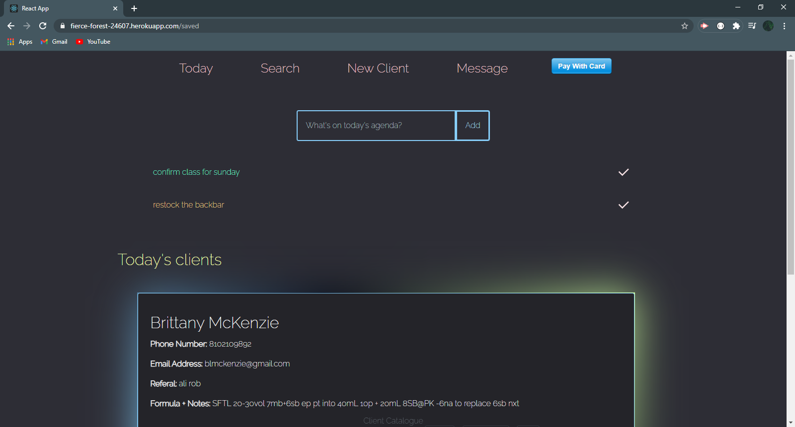

# Client-Catalogue
<a href="https://fierce-forest-24607.herokuapp.com/" data-text="client-catalogue">Click Here to Visit Client-Catalogue</a>
 

## Description
Client-Catalogue provides a virtual organization for businesses. You may add, update and charge fees to your clientelle. Update the dashboard "Today" page to provide each day's scheduled clients. This page also provides a to-do list to add and delete tasks to complete. Use the "message" page to send out a mass advertisement or letter to everyone saved in the system.

## Usage
Start by navigating to "New Client" to build your personalized clientelle and keep track of your work day. Search, charge and update client info as needed.
  

 

## Key points in building this application:
<ul>
  <li>utilizes Node & Express server</li>
  <li>React Js focused</li>
  <li>MERN stack (MongoDb, Express, React-JS, Node)
  <li>backed by Mongoose database</li>
  <li>utilizes all CRUD components</li>
  <li>deployed with Heroku</li>
  <li>utilizes technology that is new to the creator</li>
  <li>contains a polished front end/UI</li>
  <li>utilizes a folder structure that meets the MVC paradigm</li>
  <li>utilizes quality coding standards (indentation, scoping, naming)</li>
  <li>API key is protected in Node with environmental variables</li>
</ul>

## Questions
[Visit my repository!](https://www.github.com/alexemrob)
 
For any further questions email me at AlexEmRob@gmail.com
